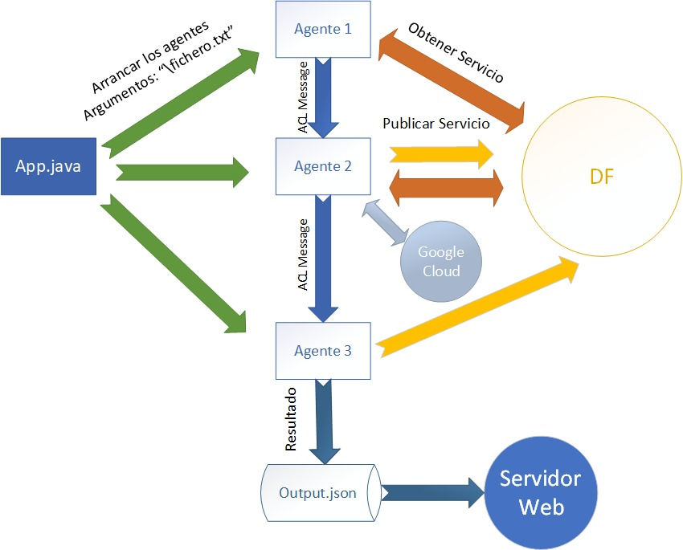

# Sentimental analysis in sentences

The main goal of this assigment is to analyze sentiment in sentences. For this purpose we had use the following technologies:

- JADE (Java)
- Google Cloud
- Node
- Google Charts

The use of JADE is to provide 3 different agents. In this image you can see how agents are related:



## Agents

In the next paragraphs will be explain how the data flows between agents. It is not included how agents behaviour works.

All the agents are defined in package named agents.

#### Agent 1

This agent will open the file given as an argument. In this file will be the content to be analyze. The structure of the file is the following:

```
Subject 1(S1): Sentence 1 of S1. Sentence 2 of S1. ... Sentence N of S1.
Subject 2(S2): Sentence 1 of S2. Sentence 2 of S2. ... Sentence N of S2.
...
Subject M(SM): Sentence 1 of SM Sentence 2 of SM. ... Sentence N of SM.
```

The agent will parse that data to a HashMap<String, String>, where the key will be the subject and the value will be all the sentences of that subject

#### Agent 2

This agent will receive the data from agent 1. It will use API calls to the Google Cloud API to analyze the data and retrieve the results.

The results will be converted to an ArrayList<Person>. The class Person is defined in package named agents. Person has an attribute call List<Sentence>. The documentation of that class can be found [here](https://cloud.google.com/natural-language/docs/reference/rest/v1/Sentence?hl=es)

#### Agent 3

It will convert all the data generated from agent 2 and it will convert it in a JSONArray. Then, it will write the JSON to ```/jade/output.json```.


## Web server

In orden to run the web server, nodeJS needs to be installed in your machine. 

#### Usage

Then, follow this steps:

1. ```cd web```
2. ```node server.js```
3. Open your browser and go to ```localhost:8080```

#### Views

In the web application you will find a menu at the top.

- Demo: It will load the information from ```/jade/output.json```.
- Songs: It will load the different songs's analysis and compare.
- 3 little pigs: It will load the information from ```/examples/3-little-pigs.json```. This is made to compare different languages models that Google provide to us.

#### Tables and charts

The tables and charts in the web are the following:

1. Table with basic information about every subject
2. All the sentences with its score and colored depending of the author
3. Relation between score and magnitude
4. Comparation between subjects: its general score, magnitude and number of messages
5. Tables with all the information for every sentence. It can by sort by any key, just clicking on the top of the table.